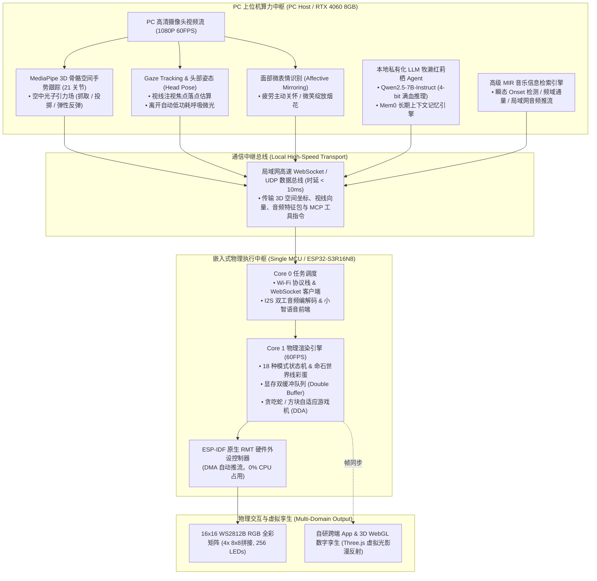

# Intelligent Lighting Control System Pro (高阶具身多模态智能光影交互系统)
### 基于异构协同的多模态具身光影交互系统 (High-Stage Capstone Project)

<p align="left">
  <b>语言切换 / Language / 言語切替:</b><br>
  <a href="README.md"><b>🇨🇳 中文</b></a> | 
  <a href="README_EN.md"><b>🇺🇸 English</b></a> | 
  <a href="README_JA.md"><b>🇯🇵 日本語</b></a>
</p>

[](https://idf.espressif.com/)
[](https://developer.nvidia.com/cuda-zone)
[](https://github.com/DongFengPo1412/Intelligent-Lighting-Control-System-Pro)
[](LICENSE)

> 🎓 **通关式项目课程——大四高阶成果 (High-Stage Capstone Project)**  
> 对标日本顶尖名校（东京大学 / 东京工业大学 / 京都大学）修士研究室（HCI 人机交互 / 嵌入式边缘智能 / 具身感知）及国际一线科技名企（Sony / Nintendo）研发标准。  
> 🔗 **大三中阶工程归档**：[Intelligent-Lighting-Control-System-Mid](https://github.com/DongFengPo1412/Intelligent-Lighting-Control-System-Mid)（双片机串口通信与基础音律矩阵）

---

## 🌟 项目亮点与高阶进化 (Evolution from Mid-Stage)

在**完全不增加额外硬件采购（零采购约束）**的前提下，系统利用现有 **PC 上位机 (RTX 4060 + 摄像头) + 单颗 ESP32-S3R16N8 + 16×16 WS2812B 矩阵**，从中阶的“被动响应式声光板”跃迁为“**主动具身多模态人机交互系统**”：

| 维度 | 大三中阶 (Mid-Stage) | 大四高阶 (Pro-Stage) |
| :--- | :--- | :--- |
| **硬件架构** | 双芯片架构 (S3 语音 + WROOM-32 灯控)，跨芯片软串口通信 | **单芯片归一化融合架构**：彻底淘汰 WROOM-32，单颗 S3 统一调度音频流、网络与光影渲染 |
| **底层渲染驱动** | Arduino 框架 + FastLED 库，软件延时发脉冲，全局关中断 | **ESP-IDF 原生 RMT 硬件外设驱动**：硬件 DMA 推流，**0% CPU 阻塞**，零中断屏蔽，60FPS 双缓冲 |
| **空间感知能力** | Jetson Nano 基础 2D 手指计数与 Haar 离线人脸分类 | **多模态具身感知系统**：PC 端 3D 骨骼关节空间手势 + 视线注意力朝向 (Gaze) + 面部情绪微表情识别 |
| **智能决策大脑** | 云端小智固定服务器，指令集固定 | **本地私有化具身 Agent**：RTX 4060 本地部署 Qwen2.5 牧濑红莉栖 Agent，Mem0 长期记忆，MCP 双向函数调用 |
| **音频交互体验** | 仅支持固定提示音，常规电平 FFT 频谱映射 | **局域网全双工无损音频流推流** + **高级 MIR 声学特征提取**（瞬态 Onset 检测、频域通量、声学流体共振） |
| **游戏与控制端** | 机械固定下落速度；依赖第三方商业平台 Blinker | **自适应动态难度调节 (DDA 心流)** + **自研跨端轻量控制 App** + **3D WebGL 数字孪生虚拟矩阵** |

---

## 🏛️ 系统拓扑架构 (System Architecture)

系统采用 **“端-云边缘异构协同（Heterogeneous Edge-Device Collaboration）”** 分布式拓扑，将密集型 AI 推理与微秒级物理脉冲控制严格分层：



---

## 🧮 18项终极功能矩阵与核心算法 (The 18 Technical Pillars)

系统严格按照 [`docs/HIGH_STAGE_SYSTEM_SPEC_18.md`](docs/HIGH_STAGE_SYSTEM_SPEC_18.md) 规格说明书进行架构与工程兑现：

### 一、 硬件驱动与系统底层革新
1. **单板 S3 硬件全面归一化**：彻底淘汰中阶 WROOM-32，单板跑 FreeRTOS 双核异构，消灭跨板通信时延（15ms ➔ 0ms）。
2. **ESP-IDF 原生 RMT 硬件驱动**：弃用 FastLED 软件延时，硬件 DMA 自动推流，发送期间零关中断，彻底杜绝 Wi-Fi 丢包与音频卡顿。
3. **显存双缓冲队列与 Gamma 校正**：前后帧交换消除 16×16 画面高频刷新撕裂，结合非线性人眼感光曲线校正，低亮度下色阶平滑无阶跃。
4. **中阶 14 种模式 1:1 像素级全量复刻**：完整保留 14 种经典光效、AI 表情与 4 块 8×8 级联闭式数学空间坐标解算器。

### 二、 具身多模态大脑与角色 Agent
5. **本地 RTX 4060 部署 Qwen2.5**：私有化运行 7B 级大语言模型，告别云端黑盒与网络波动，首字延迟（TTFT）大幅压缩。
6. **牧濑红莉栖专属人格与长期记忆**：微调傲娇少女语气风格，集成 Mem0 / 向量数据库，记住主人的称呼（“冈部”）、作息与历史话题。
7. **小智客户端魔改与 MCP 双向调用**：基于 MCP (Model Context Protocol) 规范，大模型获得对 16×16 矩阵每一颗灯珠与模式的双向函数调用权。
8. **自然语言物理沙漏倒计时**：“*红莉栖，帮我倒计时60秒*”语音触发，全屏点亮后按物理沙漏算法逐颗粒子熄灭，严格耗时 60 秒。
9. **《命运石之门》世界线变动率彩蛋**：语音触发世界线切换，点阵呈现辉光管乱数滚动与电流音效，锁定在 1.048596% 命运石之门世界线。

### 三、 空间具身感知与计算机视觉
10. **MediaPipe 3D 手势空中物理沙盒**：追踪手部 21 个 3D 关节，实现空中光子引力场——虚握聚光、捏合拖拽、推手发射光球，碰撞边界反弹并激起流体涟漪。
11. **视线追踪 (Gaze) 与头部姿态估计**：估算瞳孔注视落点，灯板像素“瞳孔”对视跟随；人离开桌前系统自动进入微光低功耗呼吸节律。
12. **面部微表情识别与情绪共鸣镜像**：疲劳皱眉时红莉栖主动关怀并切入暖色护眼光；微笑时全屏绽放烟花粒子。
13. **红莉栖像素桌宠（虚拟生命模拟）**：模拟昼夜生物节律（Circadian Rhythm），随时间呈现眨眼、呼吸微光、打哈欠与陪伴互动。

### 四、 声学流体、游戏心流与全域控制
14. **局域网实时无损音频推流**：PC / 手机本地音乐通过 Wi-Fi 实时无线推流至 S3 硬件解码播放，实现便携桌面智能音箱。
15. **高级 MIR 特征提取与声学流体引擎**：提取瞬态 Onset 检测、频域通量与节奏相位，结合重力加速度滤波与声学流体波纹扩散。
16. **经典游戏视线/手势免接触体感控制**：贪吃蛇与俄罗斯方块支持眼神注视方向转向与手势隔空挥动控制。
17. **任天堂级自适应动态难度调节 (DDA)**：根据玩家反应时间与面部紧张度微调下落速度与转向容错，维持最佳“心流（Flow）”状态。
18. **自研轻量控制 App + 3D WebGL 数字孪生**：替代 Blinker，在手机端实现毫米级调色涂鸦，并在网页端以 1:1 Three.js 仿真三维发光矩阵与桌面漫反射。

---

## 📁 代码工程目录结构 (Directory Structure)

```text
Intelligent-Lighting-Control-System-Pro/
├── docs/                       # 系统架构设计、MCP 协议规约与硬件时序文档
│   └── HIGH_STAGE_SYSTEM_SPEC_18.md # 18 项终极升级规格说明书 (SRS)
├── firmware-s3/                # 单板 ESP32-S3R16N8 原生固件 (ESP-IDF 5.4 C++)
│   ├── main/                   # FreeRTOS 双核主调度、MCP 工具注入
│   │   ├── LightController.cc  # 统一光影管理器 (接管所有模式与双缓冲)
│   │   └── rmt_ws2812.cc       # 原生硬件 RMT DMA 驱动实现
│   ├── components/             # 自研组件库 (color_math, audio_stream, mcp_client)
│   └── CMakeLists.txt
├── pc-agent-vision/            # PC 端 AI 感知与多模态 Agent (Python 3.10+ / CUDA)
│   ├── vision_tracker/         # MediaPipe 3D 手势、Gaze 视线与人脸情绪中枢
│   ├── agent_core/             # 本地 Qwen2.5 牧濑红莉栖调度引擎与 MCP 接口
│   └── tests/                  # 视觉到硬件端到端低延迟通信测试脚本
├── mobile-app/                 # 自研跨平台控制终端 & 3D WebGL 数字孪生
│   ├── web_digital_twin/       # 基于 Three.js 的 1:1 三维虚拟矩阵漫反射模拟器
│   └── app_controller/         # 局域网 WebSocket 实时调色涂鸦控制台
├── .gitignore                  # Git 忽略配置 (过滤构建缓存、Python venv 及敏感私钥)
├── README.md                   # 简体中文技术文档
├── README_EN.md                # 英文技术文档 (English)
└── README_JA.md                # 日文技术文档 (日本語)
```

---

## 📊 硬件实测基准目标 (Benchmark Targets)

面向名校学术答辩与名企工程审查，系统制定了严苛的量化性能基准：

| 性能维度 | 大三中阶 (Mid-Stage) | 大四高阶目标基准 (Pro-Stage) | 提升幅度 / 达标意义 |
| :--- | :---: | :---: | :--- |
| **单片机灯控 CPU 占用率** | 85% (软件延时阻塞) | **< 2% (硬件 RMT DMA 发送)** | 算力完全释放给网络与音频 |
| **灯板全屏渲染刷新帧率** | 30 FPS (存在抖动) | **稳定 60 FPS (硬件双缓冲)** | 杜绝画面撕裂与阶跃感 |
| **视觉手势到硬件物理延迟** | ~120 ms (受限于串口中转) | **< 35 ms (局域网极速直连)** | 达到人眼免接触交互的“无感跟手”阈值 |
| **大模型首字响应延迟 (TTFT)** | ~1800 ms (公网云端传输) | **< 250 ms (RTX 4060 本地推理)** | 媲美真人面对面对话节奏 |
| **动态电源安全负载** | 5V / 1.2A 阈值截断 | **5V / 1.2A 软件软限制 + Gamma 补偿** | 零电源过载，灯珠寿命延长 |

---

## 🚀 研发与验证路线图 (Engineering Roadmap)

- [ ] **Phase 1 (进行中)**：底座归一化与 1:1 驱动迁移（单板 S3 原生 RMT 驱动、双缓冲、中阶 14 种模式无损移植）
- [ ] **Phase 2**：PC 端视觉中枢搭建（MediaPipe 3D 手势空中物理沙盒、Gaze 视线与头部姿态估计、面部微表情镜像）
- [ ] **Phase 3**：牧濑红莉栖本地具身 Agent 部署（RTX 4060 Qwen2.5、Mem0 长期记忆、MCP 函数调用、世界线彩蛋）
- [ ] **Phase 4**：声学流体、自适应心流与自研控制端（局域网音频流推流、MIR 高级特征、自适应游戏难度 DDA、3D WebGL 数字孪生）

---

## 📜 开源许可证 (License)

本项目遵循 [MIT License](LICENSE) 开源协议。
