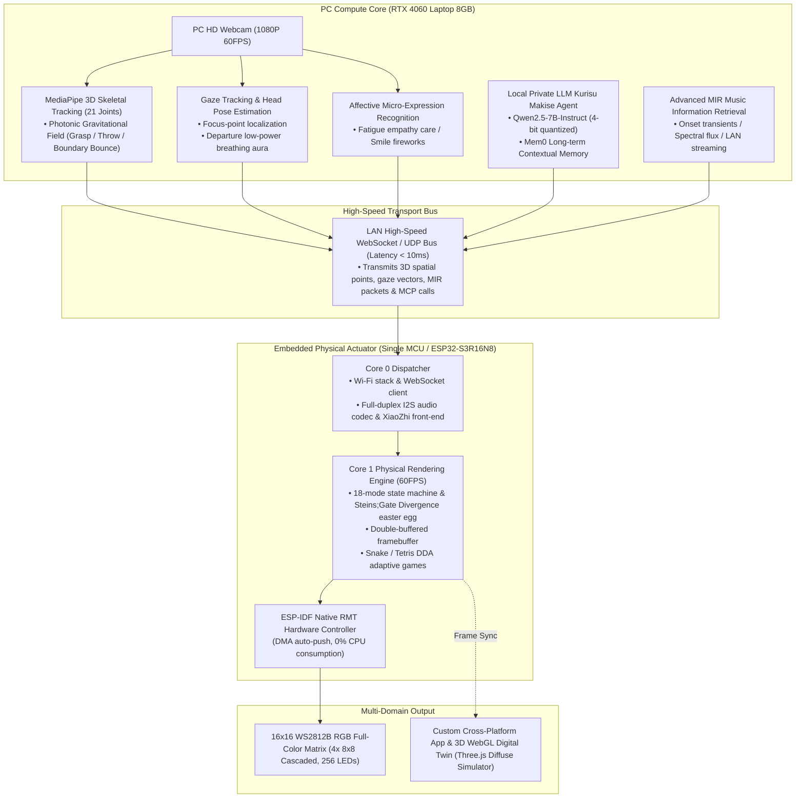

# Intelligent Lighting Control System Pro (Embodied Multimodal Lighting System)
### An Embodied Multimodal Interactive Lighting System via Heterogeneous Edge-Device Collaboration

<p align="left">
  <b>Language Switch / 言語切替:</b><br>
  <a href="README.md"><b>🇨🇳 中文</b></a> | 
  <a href="README_EN.md"><b>🇺🇸 English</b></a> | 
  <a href="README_JA.md"><b>🇯🇵 日本語</b></a>
</p>

[](https://idf.espressif.com/)
[](https://developer.nvidia.com/cuda-zone)
[](https://github.com/DongFengPo1412/Intelligent-Lighting-Control-System-Pro)
[](LICENSE)

> 🎓 **Undergraduate Capstone Project — High-Stage Engineering Archive**  
> Tailored to the rigorous research standards of top-tier Japanese graduate research laboratories (The University of Tokyo / Tokyo Tech / Kyoto Univ. in HCI, Edge AI, and Embodied Intelligence) and world-leading consumer tech enterprises (Sony, Nintendo).  
> 🔗 **Mid-Stage Baseline Archive**: [Intelligent-Lighting-Control-System-Mid](https://github.com/DongFengPo1412/Intelligent-Lighting-Control-System-Mid) (Dual-MCU baseline architecture)

---

## 🌟 Evolution from Mid-Stage: Zero-Hardware-Cost Paradigm Shift

Under strict **zero-additional-hardware constraints**, the system leverages the existing **PC Host (RTX 4060 + Webcam) + Single ESP32-S3R16N8 + 16×16 WS2812B Matrix**, transforming the mid-stage reactive lighting board into a **proactive, embodied multimodal interactive ecosystem**:

| Dimension | Mid-Stage Baseline | High-Stage Pro Evolution |
| :--- | :--- | :--- |
| **Hardware Architecture** | Dual-MCU (S3 Voice + WROOM-32 LEDs) with inter-board UART | **Unified Single-MCU Architecture**: Deprecates WROOM-32 entirely; S3 autonomously schedules audio, networking, and rendering |
| **Driver & Rendering** | Arduino FastLED bit-banging with blocking global interrupts | **ESP-IDF Native RMT Hardware Driver**: DMA-driven streaming, **0% CPU blocking**, zero interrupt suppression, 60FPS double-buffering |
| **Spatial Perception** | Jetson Nano 2D finger counting & offline Haar cascade | **Multimodal Embodied Perception**: PC-driven 3D skeletal hand tracking + Gaze attention + Facial affective micro-expression recognition |
| **Cognitive Brain** | Cloud-tethered proprietary voice server with rigid tools | **Local Private Embodied Agent**: Local Qwen2.5 Kurisu Makise character Agent on RTX 4060, Mem0 long-term memory, MCP bidirectional function calling |
| **Acoustic Interaction** | Static prompt sounds, conventional linear FFT levels | **LAN Full-Duplex Lossless Audio Streaming** + **Advanced MIR Features** (Onset detection, spectral flux, acoustic fluid simulation) |
| **Games & Control** | Fixed-speed arcade games; third-party Blinker app | **Dynamic Difficulty Adjustment (DDA Flow)** + **Custom Cross-Platform App** + **1:1 3D WebGL Digital Twin Simulation** |

---

## 🏛️ System Architecture

Adopting a **"Heterogeneous Edge-Device Collaborative"** distributed topology, compute-heavy AI tasks and microsecond-level physical pulse timing are cleanly decoupled:



---

## 🧮 The 18 Technical Pillars

Strictly aligned with [`docs/HIGH_STAGE_SYSTEM_SPEC_18.md`](docs/HIGH_STAGE_SYSTEM_SPEC_18.md):

### I. Hardware Driver & Low-Level System Innovation
1. **Unified Single-MCU Architecture**: Eliminates WROOM-32; runs FreeRTOS dual-core heterogeneously, reducing inter-board latency from 15ms to 0ms.
2. **ESP-IDF Native RMT Driver**: DMA-driven pulse transmission with zero interrupt masking, preventing Wi-Fi packet drops and audio stutters.
3. **Double-Buffered Framebuffer & Gamma Correction**: Eliminates tearing at 60FPS; compensates non-linear human visual perception for smooth low-brightness gradients.
4. **1:1 Lossless Mid-Stage Porting**: Preserves all 14 mid-stage modes, expressions, and the 4x 8x8 closed-form mathematical coordinate transformer.

### II. Embodied Multimodal Brain & Character Agent
5. **Local Qwen2.5 Deployment on RTX 4060**: 7B-parameter local inference with ultra-low Time-to-First-Token (TTFT) and full privacy protection.
6. **Kurisu Makise Character Personality & Long-Term Memory**: Fine-tuned tsundere scientist persona with Mem0 memory (remembers master's title "Okabe", habits, past topics).
7. **XiaoZhi Firmware MCP Function Calling**: Full hardware voice wake-up retained; MCP server provides LLM with bidirectional function-level control over every LED.
8. **Natural Language Semantic Hourglass Countdown**: "Kurisu, start a 60-second countdown" triggers a physical hourglass particle collapse lasting exactly 60s.
9. **Steins;Gate Divergence Meter Easter Egg**: Voice trigger initiates nixie tube random number cycling with electrical crackle audio, locking onto the 1.048596% Steins Gate worldline.

### III. Spatial Embodied Perception & Computer Vision
10. **MediaPipe 3D Hand Gestures & Physics Sandbox**: 21-joint tracking drives an aerial photonic field—gather energy by opening palms, drag by pinching, shoot towards matrix with elastic boundary bounces.
11. **Gaze Tracking & Head Pose Estimation**: Pixilated "pupils" follow human eyes; system gracefully dims into a low-power circadian breathing glow when user walks away.
12. **Affective Micro-Expression Recognition**: Detects fatigue/frowning to trigger warm amber eye-care light and soothing voice care; triggers fireworks on smiles.
13. **Kurisu Desktop Cyber Pet**: Circadian rhythm simulation (breathing, blinking, yawning, sleeping) with authentic voice lines.

### IV. Acoustic Fluids, Flow Gaming & Universal Control
14. **LAN Real-Time Lossless Audio Streaming**: Streams PC/mobile audio wirelessly to S3 hardware DAC, turning the device into a desktop smart speaker.
15. **Advanced MIR Engine & Acoustic Fluid Resonance**: Onset transient detection, spectral flux, and beat phase drive dynamic fluid wave equations across the matrix.
16. **Contactless Gaze/Gesture Game Controls**: Steers Snake and Tetris via eye gaze orientation or airborne hand waves.
17. **Nintendo-Grade Dynamic Difficulty Adjustment (DDA)**: Adapts drop speeds and turn tolerances based on reaction times and facial stress to sustain player "Flow".
18. **Custom Cross-Platform App & 3D WebGL Digital Twin**: Replaces Blinker with a native responsive UI and a Three.js 1:1 photorealistic physical diffuse simulator.

---

## 📁 Repository Structure

```text
Intelligent-Lighting-Control-System-Pro/
├── docs/                       # Architectural blueprints, MCP protocol specs & timing docs
│   └── HIGH_STAGE_SYSTEM_SPEC_18.md # The definitive 18-point System Requirements Spec
├── firmware-s3/                # ESP32-S3R16N8 Native Firmware (ESP-IDF 5.4 C++)
│   ├── main/                   # FreeRTOS dual-core scheduler, MCP tool injection
│   │   ├── LightController.cc  # Unified light engine & double-buffered manager
│   │   └── rmt_ws2812.cc       # Native RMT DMA hardware driver
│   ├── components/             # Custom libraries (color_math, audio_stream, mcp_client)
│   └── CMakeLists.txt
├── pc-agent-vision/            # PC AI Perception & Agent Hub (Python 3.10+ / CUDA)
│   ├── vision_tracker/         # MediaPipe 3D hand, Gaze & facial expression core
│   ├── agent_core/             # Local Qwen2.5 Kurisu engine & MCP server
│   └── tests/                  # Latency and throughput automated test suites
├── mobile-app/                 # Cross-platform controller & 3D WebGL Digital Twin
│   ├── web_digital_twin/       # Three.js 1:1 photorealistic virtual matrix simulation
│   └── app_controller/         # Local WebSocket color-picker & matrix doodle pad
├── .gitignore                  # Git ignore rules
├── README.md                   # Simplified Chinese Document
├── README_EN.md                # English Document
└── README_JA.md                # Japanese Document (日本語)
```

---

## 📊 Target Performance Benchmarks

| Metric | Mid-Stage Baseline | High-Stage Pro Target | Engineering Significance |
| :--- | :---: | :---: | :--- |
| **MCU Lighting CPU Utilization** | 85% (Bit-banging blocking) | **< 2% (Hardware RMT DMA)** | Compute freed for audio and network |
| **Matrix Render Frame Rate** | 30 FPS (Jitter-prone) | **Rock-solid 60 FPS (Double Buffer)** | Zero frame tearing and smooth gradients |
| **Vision-to-Actuator Latency** | ~120 ms (Serial bottleneck) | **< 35 ms (High-speed LAN bus)** | Imperceptible contactless hand tracking |
| **LLM Time-to-First-Token (TTFT)**| ~1800 ms (Cloud roundtrip) | **< 250 ms (Local RTX 4060)** | Natural conversational pace |
| **Dynamic Power Limitation** | 5V / 1.2A hard cutoff | **5V / 1.2A soft limiter + Gamma** | Zero brownout risk, extended LED lifespan |

---

## 🚀 Engineering Roadmap

- [ ] **Phase 1 (In Progress)**: Foundation unification & 1:1 driver migration (Native RMT driver, double-buffering, mid-stage mode porting)
- [ ] **Phase 2**: PC vision perceptual hub (MediaPipe 3D gestures, Gaze attention, affective mirroring)
- [ ] **Phase 3**: Local Kurisu Makise embodied Agent (RTX 4060 Qwen2.5, Mem0 memory, MCP tools, Divergence Meter)
- [ ] **Phase 4**: Acoustic fluids, adaptive flow & custom control (LAN audio streaming, MIR engine, DDA games, 3D WebGL Digital Twin)

---

## 📜 License

This project is licensed under the [MIT License](LICENSE).
