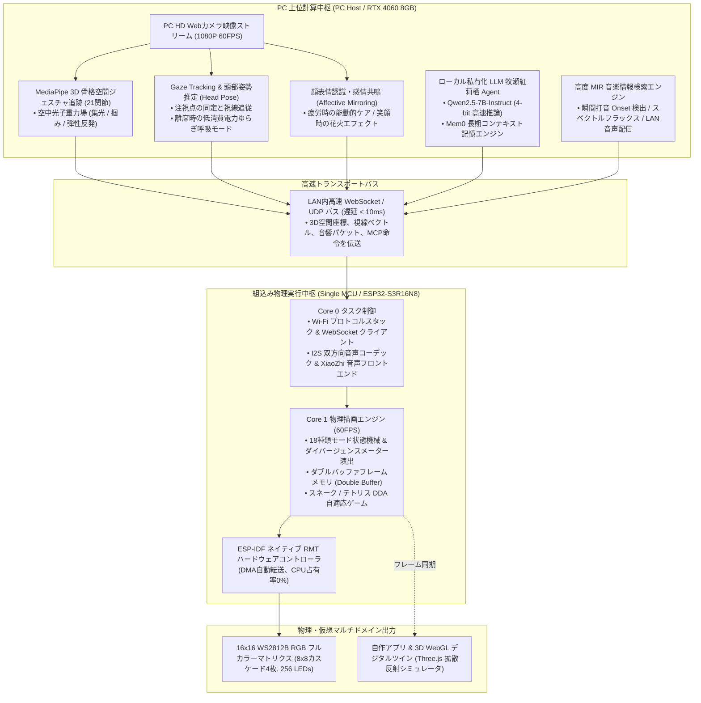

# Intelligent Lighting Control System Pro (身体性マルチモーダル照明システム)
### 異種協調エッジコンピューティングによる身体性マルチモーダル光影対話システム (High-Stage Capstone Project)

<p align="left">
  <b>言語切替 / Language Switch:</b><br>
  <a href="README.md"><b>🇨🇳 中文</b></a> | 
  <a href="README_EN.md"><b>🇺🇸 English</b></a> | 
  <a href="README_JA.md"><b>🇯🇵 日本語</b></a>
</p>

[](https://idf.espressif.com/)
[](https://developer.nvidia.com/cuda-zone)
[](https://github.com/DongFengPo1412/Intelligent-Lighting-Control-System-Pro)
[](LICENSE)

> 🎓 **大学通関型創成プロジェクト——学部上位成果（High-Stage Capstone Project）**  
> 日本の難関国立大学大学院（東京大学・東京工業大学・京都大学等）の修士研究室（HCI、エッジ知能、身体性知能）および世界最高峰のハードウェア・ゲーム企業（ソニー・任天堂）の開発水準を基準に設計。  
> 🔗 **学部中間成果アーカイブ**：[Intelligent-Lighting-Control-System-Mid](https://github.com/DongFengPo1412/Intelligent-Lighting-Control-System-Mid)（デュアルマイコン通信と基礎マトリクス）

---

## 🌟 中間成果からの飛躍：ハードウェア追加コストゼロのパラダイムシフト

ハードウェアの**追加購入ゼロという厳格な制約**のもと、既存の **PCホスト（RTX 4060 ＋ Webカメラ）＋ 単一マイコン ESP32-S3R16N8 ＋ 16×16 WS2812B マトリクス** を最大限に駆使し、中間段階の受動的な照明装置から**「能動的・身体性マルチモーダル対話システム」**へと進化させました：

| 評価軸 | 学部中間段階 (Mid-Stage) | 学部上位段階 (Pro-Stage) |
| :--- | :--- | :--- |
| **ハードウェア構成** | デュアルマイコン構成（S3音声 ＋ WROOM-32照明）、低速シリアル通信 | **単一マイコン統合アーキテクチャ**：WROOM-32を完全撤廃。S3が音声・通信・描画を一括集中制御 |
| **描画・駆動制御** | Arduino FastLED ソフトウェア遅延、全割り込み禁止による遅延 | **ESP-IDF ネイティブ RMT ハードウェア駆動**：DMA自動転送、**CPU占有率0%**、割り込み非遮断、60FPSダブルバッファ |
| **空間認識・センサ** | Jetson Nano 2D指カウント認識、Haar特徴分類による静的顔判定 | **マルチモーダル身体性認識**：PC側 3D骨格空間ジェスチャ ＋ 視線推定 (Gaze) ＋ 顔表情微小変化による感情推定 |
| **知能・頭脳コア** | クラウド固定サーバ、硬直したコマンドセット | **ローカル私有化身体性 Agent**：RTX 4060 上で Qwen2.5 牧瀬紅莉栖 Agent を直接稼働、Mem0 長期記憶、MCP 双方向関数呼出 |
| **音響インタラクション**| 固定ビープ音、一般的なリニア振幅 FFT による簡易跳ね上がり | **LAN内フルデュプレックス可逆音声ストリーミング** ＋ **高度 MIR 音響特徴抽出**（Onset 瞬間打音検出、スペクトルフラックス、流体共鳴） |
| **ゲーム・操作端末** | 固定速度レトロゲーム、既製アプリ（Blinker）依存 | **動的難易度自動調整（DDA フロー理論）** ＋ **自作マルチプラットフォームアプリ** ＋ **3D WebGL デジタルツイン仮想シミュレータ** |

---

## 🏛️ システム全体構成 (System Architecture)

**「エッジ・デバイス異種協調（Heterogeneous Edge-Device Collaboration）」** 分散アーキテクチャを採用し、高負荷なAI推論とマイクロ秒精度のパルス生成を明確に階層分離しました：



---

## 🧮 18大技術項目とコアアルゴリズム (The 18 Technical Pillars)

システム仕様書 [`docs/HIGH_STAGE_SYSTEM_SPEC_18.md`](docs/HIGH_STAGE_SYSTEM_SPEC_18.md) に厳密に準拠して実装されます：

### 一、 ハードウェア駆動と低レイヤシステム革新
1. **単一 S3 ハードウェア統合**：WROOM-32 を廃止し、FreeRTOS デュアルコア異種タスクスケジューリングによりマイコン間遅延を 15ms から 0ms へ短縮。
2. **ESP-IDF ネイティブ RMT 駆動**：DMA 転送により CPU を一切ブロックせず、割り込み非遮断で Wi-Fi パケットロスと音飛びを完全根絶。
3. **ダブルバッファフレームメモリ＆ガンマ補正**：前後フレーム交換により 60FPS 下の画面テアリングを解消。非線形ガンマ補正により低輝度時の階調飛びを防止。
4. **中間段階の全14種エフェクト 1:1 移植**：既存の多彩な照明効果、表情描画、閉形式座標変換アルゴリズムを損失なく完全継承。

### 二、 身体性マルチモーダル知能とキャラクター Agent
5. **RTX 4060 上の Qwen2.5 ローカル稼働**：7B クラスの LLM を私有環境で実行。外部クラウドへの依存をなくし、初回応答時間（TTFT）を極小化。
6. **牧瀬紅莉栖キャラクター人格＆長期記憶**：ツンデレ助手の語り口を忠実に再現。Mem0 メモリにより主人の呼び名（「岡部」）、生活リズム、過去の対話を記憶。
7. **XiaoZhi 改造＆ MCP 双方向ツール呼出**：音声起動を維持しつつ、MCP 規格により LLM から LED 1粒ごとの物理制御を関数レベルで実行。
8. **自然言語による物理砂時計カウントダウン**：「紅莉栖、60秒測って」の音声指示で全画面が点灯後、粒子が物理法則に従って消灯し正確に60秒で終了。
9. **『シュタインズ・ゲート』世界線変動率演出**：音声合言葉によりニキシー管風乱数スクロールと放電音が鳴り響き、1.048596% 運命石の扉世界線へ突入。

### 三、 空間身体性知覚とコンピュータビジョン
10. **MediaPipe 3D 空間ジェスチャ物理サンドボックス**：手部21関節をトラッキングし、空中光子重力場を形成。光球の凝縮、掴み移動、投擲と境界弾性反発を実現。
11. **視線追従 (Gaze) ＆頭部姿勢推定**：瞳孔の注視点を計算し、LED上の「瞳」がユーザを見つめ返す。離席時は低消費電力の生体リズム呼吸モードへ移行。
12. **顔表情認識による感情ミラーリング**：疲労や眉間のシワを感知すると助手が優しく声を掛け、アンバー色の暖色光へ切替。笑顔時には花火が打ち上がる。
13. **紅莉栖ピクセルデスクトップペット**：生体リズム（サーカディアンリズム）を模擬し、時間帯に応じた瞬き、呼吸ゆらぎ、居眠り動作を自律実行。

### 四、 音響流体、フローゲーム、統合制御
14. **LAN内リアルタイム可逆音声ストリーミング**：PCやスマホの楽曲を Wi-Fi 経由で S3 へ無線伝送し、卓上スマートスピーカとして再生。
15. **高度 MIR 特徴抽出＆音響流体エンジン**：Onset 瞬間打音、スペクトルフラックスを解析し、重力減衰と結合して点陣上に音響波紋を流体拡散。
16. **視線・ジェスチャによる非接触ゲーム操作**：スネークやテトリスを視線の向きや手のスワイプだけで直感的にプレイ可能。
17. **任天堂基準の動的難易度自適応調整 (DDA)**：プレイヤーの操作速度や表情の焦り度合いに応じて落下速度や判定猶予を微調整し、最適「フロー体験」を持続。
18. **自作軽量アプリ＆ 3D WebGL デジタルツイン**：Blinker を完全代替。Three.js によりブラウザ上で 1:1 実機拡散反射をシミュレーション。

---

## 📁 プロジェクトディレクトリ構成 (Directory Structure)

```text
Intelligent-Lighting-Control-System-Pro/
├── docs/                       # システム構造設計、MCPプロトコル仕様書
│   └── HIGH_STAGE_SYSTEM_SPEC_18.md # 18大技術項目仕様書 (SRS)
├── firmware-s3/                # ESP32-S3R16N8 ネイティブファームウェア (ESP-IDF 5.4 C++)
│   ├── main/                   # FreeRTOS デュアルコア制御、MCPツール注入
│   │   ├── LightController.cc  # 照明描画コア＆ダブルバッファ管理
│   │   └── rmt_ws2812.cc       # ネイティブ RMT DMA 駆動実装
│   ├── components/             # 自作コンポーネント (color_math, audio_stream, mcp_client)
│   └── CMakeLists.txt
├── pc-agent-vision/            # PC側 AI認識＆マルチモーダル Agent (Python 3.10+ / CUDA)
│   ├── vision_tracker/         # MediaPipe 3D骨格、視線追従、顔表情中枢
│   ├── agent_core/             # ローカル Qwen2.5 牧瀬紅莉栖エンジン＆ MCP サーバ
│   └── tests/                  # 低遅延通信検証スクリプト
├── mobile-app/                 # クロスプラットフォーム制御アプリ＆ 3D WebGL デジタルツイン
│   ├── web_digital_twin/       # Three.js 1:1 リアルタイム拡散反射シミュレータ
│   └── app_controller/         # LAN内 WebSocket カラーピッカー端末
├── .gitignore                  # Git除外設定
├── README.md                   # 中国語技術ドキュメント (簡体中文)
├── README_EN.md                # 英語技術ドキュメント (English)
└── README_JA.md                # 日本語技術ドキュメント (日本語)
```

---

## 📊 目標性能ベンチマーク (Target Performance Benchmarks)

名門大学院試および最高峰エンジニア採用に耐えうる定量的評価指標を設定：

| 評価指標 | 学部中間段階 (Mid-Stage) | 学部上位目標 (Pro-Stage) | 技術的意義 |
| :--- | :---: | :---: | :--- |
| **マイコン照明制御 CPU占有率** | 85% (ソフトウェア遅延) | **< 2% (ハードウェア RMT DMA)** | 音声・ネットワーク処理へ余力を完全解放 |
| **マトリクス描画フレームレート**| 30 FPS (ジッター多発) | **安定 60 FPS (ダブルバッファ)** | 画面テアリング完全解消と滑らかな階調表現 |
| **ビジョン〜実機物理遅延** | ~120 ms (シリアル中継ボトルネック) | **< 35 ms (LANダイレクト直結)** | 人間の知覚閾値を下回る超追従性 |
| **LLM初回応答遅延 (TTFT)** | ~1800 ms (外部クラウド往復) | **< 250 ms (ローカル RTX 4060)** | 生身の人間と対面しているかのような対話リズム |
| **動的電力安全保護** | 5V / 1.2A 閾値遮断 | **5V / 1.2A ソフトウェア制限＋ガンマ補正** | 電圧降下によるリセットを根絶、長寿命化 |

---

## 🚀 開発ロードマップ (Roadmap)

- [ ] **Phase 1 (進行中)**：基盤統合と 1:1 駆動移植（S3 ネイティブ RMT 駆動、ダブルバッファ、中間段階14種モード完全移植）
- [ ] **Phase 2**：PC 側ビジョン認識中枢構築（MediaPipe 3D 空間ジェスチャ、視線・頭部姿勢追従、感情認識）
- [ ] **Phase 3**：牧瀬紅莉栖ローカル身体性 Agent 構築（RTX 4060 Qwen2.5、Mem0 長期記憶、MCP 呼出、世界線演出）
- [ ] **Phase 4**：音響流体、自適応ゲーム、自作制御端末（LAN音声配信、MIRエンジン、DDAゲーム、3D WebGL デジタルツイン）

---

## 📜 ライセンス (License)

本プロジェクトは [MIT License](LICENSE) の下で公開されています。
